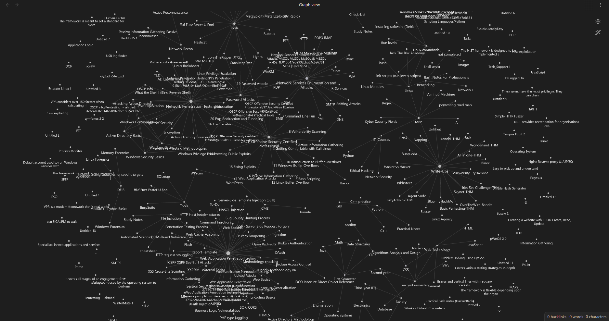
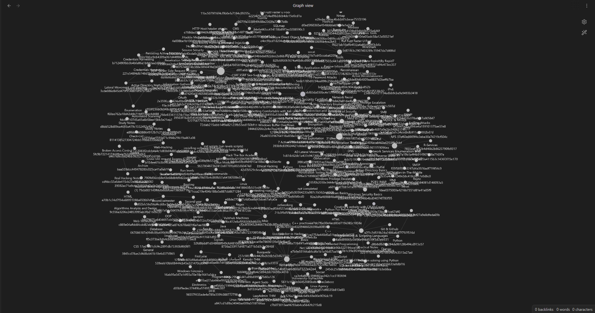
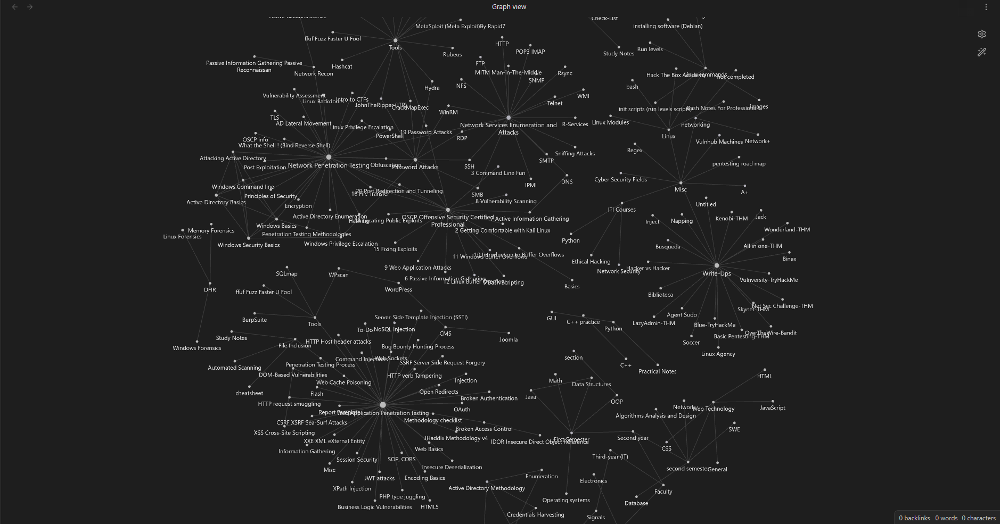

# Notion Backup Renamer

## Overview

The "Notion Backup Renamer" is a Python script designed to enhance the organization and readability of your Notion backup files and directories. It addresses the following key features:

1. **Human-Readable Naming:** The script renames all files and directories within your Notion backup to human-friendly names, making it easier to understand and navigate your backup structure.

2. **Link Editing:** It updates links within your Notion content to reflect the renamed files and directories. This ensures that your links remain valid and functional after the renaming process.

3. **Handling Repeated Names:** In cases where there are duplicate names in your backup, the script appends a unique identifier to the filenames, preventing naming conflicts and maintaining data integrity.

## Output Explanation

=============== current directory: **Current directory to rename its children** ===============
**file/directory**: **old_name => new_name**
  Updating links from: **old_name -> new_name**
    update links in **file contains a link to old_name**
    update links in **another file contains a link to old_name** 

```
=============== current directory: exports/Network Penetration Testing/Network Services Enumeration and Attacks ===============

file: FTP 02e3a53b020a4115b3c1436f3f15e170.md => FTP.md
	Updating links from: FTP 02e3a53b020a4115b3c1436f3f15e170.md -> FTP.md
		update links in exports/Network Penetration Testing/Network Services Enumeration and Attacks/FTP.md 
		update links in exports/Network Penetration Testing/Network Services Enumeration and Attacks.md 

file: NFS 37ef60e8909f4c2ebe30a74219cf504c.md => NFS.md
	Updating links from: NFS 37ef60e8909f4c2ebe30a74219cf504c.md -> NFS.md
		update links in exports/Network Penetration Testing/Network Services Enumeration and Attacks/NFS.md 
		update links in exports/Network Penetration Testing/Network Services Enumeration and Attacks.md 
<SNIP>

directory: FTP 02e3a53b020a4115b3c1436f3f15e170 => FTP
	Updating links from: FTP 02e3a53b020a4115b3c1436f3f15e170 -> FTP
		update links in exports/Network Penetration Testing/Network Services Enumeration and Attacks/FTP.md 

directory: SMB f56764d7140d45aebbea731b97281492 => SMB
	Updating links from: SMB f56764d7140d45aebbea731b97281492 -> SMB
		update links in exports/Network Penetration Testing/Network Services Enumeration and Attacks/SMB.md 

directory: NFS 37ef60e8909f4c2ebe30a74219cf504c => NFS
	Updating links from: NFS 37ef60e8909f4c2ebe30a74219cf504c -> NFS
		update links in exports/Network Penetration Testing/Network Services Enumeration and Attacks/NFS.md 
<SNIP>
```

The script generates detailed output as it processes your Notion backup. Here's an explanation of the output format:

- The script starts by displaying the current directory it's processing.

- For each file that it renames, it shows the original filename and the new human-readable name. It also indicates that it's updating links related to this file.

- For each directory that it renames, it shows the original directory name and the new human-readable name. It also indicates that it's updating links related to this directory.

- If there are duplicate names in your backup, it appends unique identifiers and updates links accordingly.

- The script provides a clear path to where it's updating links, ensuring that your Notion content remains consistent.

## Before and After Use

Here's a visual representation of the difference between using the "Notion Backup Renamer" before and after running the script:

**Before:**


**After:**


## Obsidian mindmap
Before: 

After:


- Another example 
Before: 

After: 


## Credits

### Original Project

This project is heavily based on [`notion-backup`](https://github.com/upleveled/notion-backup), created by [upleveled](https://github.com/upleveled). We extend our gratitude to the original creators for their valuable work.


